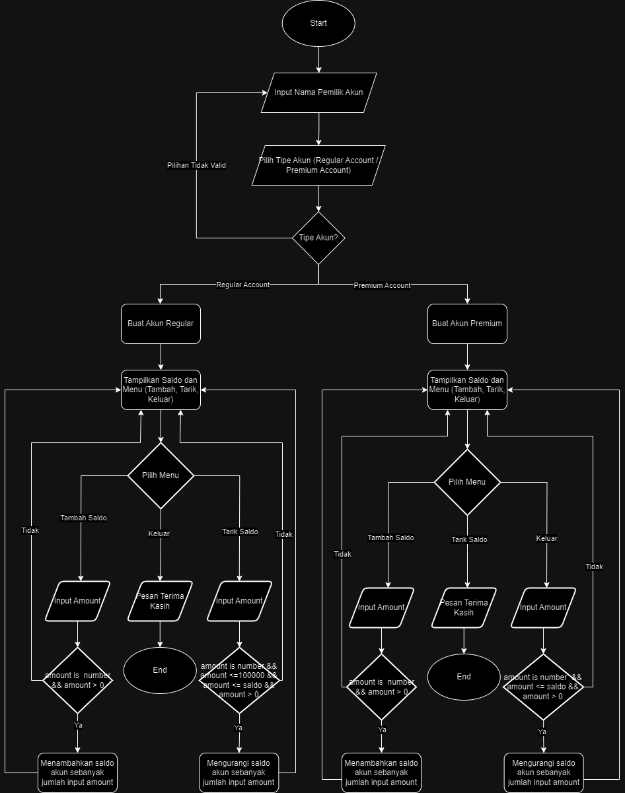

# Basic Banking System 
## Challenge Chapter 2

### Juan Verrel Tanuwijaya  
### Kelas: BEJS-1  

---

## Deskripsi Singkat
Program ini adalah sistem bank sederhana yang memungkinkan pengguna untuk mengelola akun bank mereka melalui terminal. Pengguna dapat membuat akun, melakukan setoran, dan menarik uang. Terdapat dua jenis akun yang tersedia:
- **Akun Regular**: Akun dengan batas penarikan maksimum Rp100.000.
- **Akun Premium**: Akun dengan keistimewaan tanpa batasan penarikan.

- **Cara Menjalankan Program**: node banking_system.js

---

## Flowchart
Berikut adalah flowchart yang menggambarkan alur dari program:

---

## Penjelasan Flowchart

### 1. **Mulai Program**  
   - Program dimulai dan pengguna diminta untuk menginputkan nama akun.

### 2. **Pilih Jenis Akun**
   - Pengguna dapat memilih antara dua opsi jenis akun:
     - **1. Akun Regular**: Memiliki batas penarikan maksimum (Rp100.000).
     - **2. Akun Premium**: Tidak memiliki batas penarikan.
     - Jika pengguna menginputkan selain dari pilihan diatas maka dianggap tidak valid dan akan kembali ke awal program. 

### 3. **Pembuatan Akun**
   - Berdasarkan pilihan pengguna, objek **RegularAccount** atau **PremiumAccount** dibuat.
   - Sistem kemudian menampilkan saldo awal dari akun yang baru dibuat.

### 4. **Menu Utama**
   - Pengguna diberikan pilihan menu utama dengan tiga opsi:
     1. Menambah saldo (deposit).
     2. Menarik saldo (withdraw).
     3. Keluar dari program.
     - Jika pengguna menginputkan selain dari pilihan diatas maka dianggap tidak valid dan akan kembali ke pilihan menu utama.

### 5. **Tambah Saldo (Deposit)**
   - Jika pengguna memilih opsi untuk menambah saldo, sistem akan meminta jumlah yang ingin ditambah ke saldo. Sistem akan memeriksa apakan inputan merupakan angka dan lebih dari 0, jika tidak valid maka akan dikembalikan ke menu utama. Jika valid, sistem akan delay selama 3 detik sebelum menampilkan pesan saldo berhasil ditambah sebanyak jumlah yang diinputkan pengguna.

### 6. **Tarik Saldo (Withdraw)**
   - Jika pengguna memilih opsi untuk menarik saldo, sistem akan memeriksa apakah inputan merupakan angka, inputan lebih dari 0, dan saldo mencukupi. Untuk akun regular, terdapat batasan penarikan Rp100.000, sedangkan akun premium dapat menarik saldo tanpa batasan, asalkan inputan merupakan angka, inputan lebih dari 0, dan saldo mencukupi. Jika tidak valid maka akan dikembalikan ke menu utama, sedangkan jika valid, sistem akan delay selama 3 detik sebelum menampilkan pesan saldo telah berkurang sebanyak jumlah yang diinputkan pengguna.

### 7. **Keluar Program**
   - Jika pengguna memilih untuk keluar, program akan mengakhiri sesi dan menampilkan pesan terima kasih.

---
